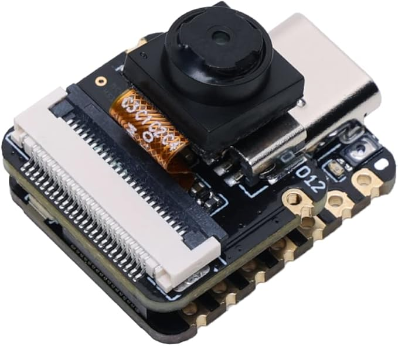
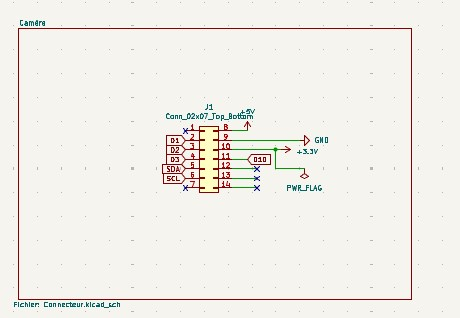
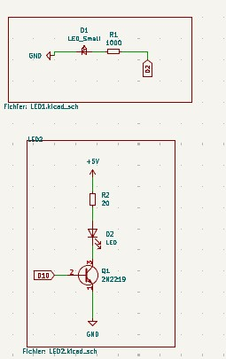
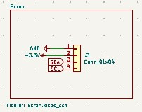
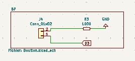
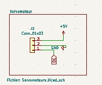
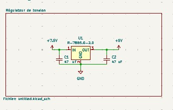
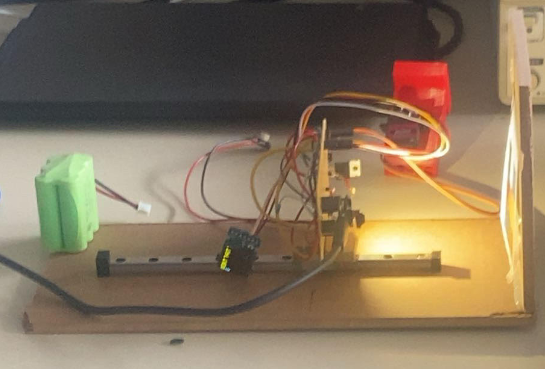

# Projet d'électronique 1A : Jeu du taquin
#### Par:
-Victor FOUREL \
-Agheles MEKDACHE \
-Rania BENSLIMAN \
-Anya ADJOU
#### Réalisé sous la direction de M. Antoine TAUVEL
# Table des matières
###  Introduction 
### 1- Caméra 
### 2- PCB
### 3- Modèle 3D
### 4- Prototype
### 5- Code
### Bilan
# Introduction 
Dans le cadre du projet d’électronique, nous devions créer un escape game composé de trois chambres. Pour notre chambre, nous avons décidé de réaliser un jeu de taquin. Une fois le puzzle résolu, une clef est délivrée. Cette clef est indispensable pour gagner l’escape game.

  

Le principe du jeu est simple : il s’agit d’un puzzle composé de 8 pièces numérotées de 1 à 8, placées dans une grille de 3x3 avec une case vide. Le joueur doit faire glisser les pièces en utilisant la case vide pour les remettre dans le bon ordre. Le jeu commence avec les pièces dans le désordre, et le joueur doit les réorganiser correctement pour réussir.
## Structure technique

Notre dispositif est composé de plusieurs couches :

- **En dessous** de la structure de jeu se trouve un **capteur**, chargé de suivre les mouvements des pièces et de détecter l’état du puzzle.
- **Le capteur** se trouve sur  un **PCB (circuit imprimé)** qui assure la liaison entre les différents composants électroniques.
- Enfin, la **structure du jeu de taquin en 3D** est positionnée au-dessus de l’ensemble.

Une fois la bonne combinaison atteinte, un mécanisme intégré permet la **libération automatique de la clé**, constituant ainsi la récompense et la progression vers la salle suivante.

# 1-Caméra 
Pour assurer un suivi en temps réel de la progression du joueur, nous avons utilisé la caméra ESP32-S3 Sense. Ce module caméra joue le rôle de capteur intelligent : il analyse l’état du puzzle à chaque instant et détecte automatiquement lorsque le joueur a correctement résolu le jeu. Une fois le bon agencement reconnu, la caméra déclenche la libération de la clé.

  

Ce choix technologique nous a permis d’ajouter une dimension interactive et autonome à notre chambre d’escape game, tout en intégrant des compétences en traitement d’image, microcontrôleurs et automatisation.

# 2- PCB
Notre carte PCB se décompose d'abord d'un module ESP32-S3 Sense  intégré  via un connecteur 2x7 broches (J1), permettant son raccordement direct à l’alimentation et aux lignes de communication. Il est alimenté en +3.3V via une broche dédiée, tandis que le reste du système fonctionne en 5V. La caméra communique avec d'autres périphériques (comme l’écran OLED) à travers le bus I2C (SDA/SCL), et plusieurs broches GPIO (D1 à D4) sont disponibles pour des entrées/sorties numériques.

  

Ces GPIO peuvent être utilisés pour contrôler la LED via un transistor, ou piloter le servomoteur chargé de la libération de la clé. Le module réalise localement l’analyse d’image (suivi des positions du puzzle) et déclenche les actions nécessaires via le PCB en fonction de l’état du jeu. Il agit ainsi comme unité centrale de traitement et de commande du système.
 
Après, deux circuits LED sont présents sur le PCB. Le premier est une LED simple avec résistance de limitation, utilisée comme témoin d’alimentation ou d’état général. Le second est une LED contrôlée par un transistor 2N2222, ce qui permet d’allumer une LED plus puissante ou de l’intégrer dans une logique de commande via microcontrôleur. Cette LED peut servir à signaler la résolution du puzzle ou indiquer un changement d’état.

  

Ainsi, on a branché un écran OLED, connecté via le bus I2C, sert d’interface visuelle pour le joueur. Il permet d’afficher des messages utiles : état du jeu, instructions, chronomètre, ou félicitations en cas de réussite. Sa faible consommation et sa simplicité d’utilisation en I2C en font un excellent choix pour les projets embarqués.

  

Après, un bouton-poussoir est également intégré au PCB. Il est utilisé pour démarrer une nouvelle partie, réinitialiser le système et envoyer une commande manuelle à la caméra. Une résistance de pull-down est utilisée pour s’assurer que l’entrée est bien à l’état bas lorsque le bouton n’est pas pressé, évitant ainsi les déclenchements erronés.

  

Le servomoteur est la partie du circuit qui permet d’agir physiquement sur le jeu. Il reçoit un signal électrique envoyé par la caméra ou le microcontrôleur quand le puzzle est résolu. Dès qu’il reçoit ce signal, le servomoteur tourne pour ouvrir une trappe ou libérer une clé. Ce système transforme le succès dans le jeu en une action réelle, ce qui rend l’expérience plus interactive et concrète pour le joueur.

  

Finalement, le système est alimenté par une source de tension de +7.5V, connectée via un bornier dédié. Cette tension est ensuite régulée par un régulateur linéaire 7805, qui abaisse la tension à +5V, nécessaire au bon fonctionnement des composants électroniques. Deux condensateurs de 47 µF (placés en entrée et en sortie du régulateur) assurent la stabilité de la tension en filtrant les éventuelles perturbations électriques. Cette alimentation stabilisée est cruciale pour éviter des comportements imprévisibles, notamment pour le module caméra, le servomoteur et l’écran OLED.

  

# 3- Modèle 3D

### Taquin 3D
Nous réalisé un modèle 3D d’un taquin aux dimensions finales de 6 cm sur 6 cm. Chaque pièce du taquin a été conçue avec des rainures et creux de chaques cotés de chaque pièces, permettant un bon encastrement et un coulissement fluide des pièces entre elles. 

  

  

  

Initialement, une autre taille avait été envisagée, mais nous avons dû adapter les dimensions du modèle en fonction des contraintes imposées par la caméra utilisée, notamment pour garantir une bonne visibilité et un bon suivi des pièces pendant l’utilisation. 

  

### Système d'éjéction 3D
Le système d’éjection de clés repose sur un mécanisme à ressorts intégré dans un récipient allongé. Au fond de ce récipient, des clous équitablement répartis servent de support et de guide pour les ressorts, un ressort est inséré dans chaque clou. Une plaque supérieure vient ensuite comprimer ces ressorts, maintenue par un loquet de blocage. Une fois la clé placée au-dessus, ce loquet (relié à un servomoteur) empêche l’éjection tant que le jeu n’est pas terminé. Lorsque l’utilisateur réussit, le servomoteur se déclenche, libère le loquet, et les ressorts se détendent, projetant la clé vers l’extérieur. 

Toutefois, nous n’avons pas réussi à concevoir une solution plus pratique à gérer pour le réalisateur du jeu : en effet, l’éjection entraîne en même temps les ressorts et l’ensemble du mécanisme, rendant le système à usage unique. Il faut donc le reconstituer manuellement entre chaque joueur, ce qui s’avère peu pratique. Pour une prochaine version, il sera essentiel de penser non seulement à la simplicité d’utilisation pour le joueur, mais aussi à la facilité de réinitialisation et de gestion pour la personne du jeu.

# 4- Prototype
Pour le prototype 3D présenté, nous avons fait le choix, par soucis de clarté et par manque de temps, de réaliser une démonstration hors du cube. Le montage a ainsi été fait de manière simplifiée : nous avons assemblé des planches en bois perpendiculaires entre elles, avec deux longueurs différentes — une plus courte et une plus longue. Sur la planche la plus longue, nous avons installé un système de glissoir permettant d’ajuster manuellement la distance de la caméra afin d’obtenir un cadrage optimal du taquin. 

  

Cependant, plusieurs problèmes techniques ont émergé, notamment au niveau de l’éclairage : la LED utilisée produisait une lumière brute et non diffuse, provoquant des reflets gênants sur le quadrillage utilisé pour la calibration de la caméra. Ce quadrillage, de dimensions 6 cm par 6 cm et correspondant à la taille réelle du taquin, avait été imprimé sur des feuilles avec différentes couleurs destinées à être détectées par la caméra. Toutefois, ces couleurs étaient trop proches en termes de carnation, ce qui causait des imprécisions dans la détection par l’algorithme de traitement d’image. Une solution plus fiable aurait été d’utiliser, pour chaque case du quadrillage représentant le taquin, un pourcentage unique de blanc et de noir. Grâce à ces contrastes bien marqués, l’algorithme aurait pu identifier chaque case de manière plus précise.

# 5- Code

Le choix a été fait de coder en Arduino. En effet, comme nous avons utilisé un ESP32 muni d'une caméra, il était beaucoup plus raisonnable, pour un premier projet utilisant cette technologie, d'utiliser des librairies existantes plutôt que de s'acharner à tout recoder/configurer soi-même sur CubeIDE.

Toutefois, cela n'a pas été si évident d'utiliser ces ressources, qui étaient relativement cachées sur un GitHub. La personne chargée du code a beaucoup appris lors de cette étape, que ce soit pour la compréhension de la structure des projets/librairies disponibles en open source, ou sur leur utilisation/implémentation efficace. En effet, le jeune programmeur a eu quelques sueurs froides à la lecture des différentes librairies s'étalant sur des centaines de lignes, mais il a finalement été rassuré quand il a compris qu'un seul appel de fonction faisait opérer la magie.

Après la capture de l'image effectuée avec la commande magique, le premier challenge fut de réussir à visualiser l'image sur l'ordinateur pour s'assurer du bon fonctionnement de la caméra. Pour ce faire, la première solution fut l'utilisation d'une carte SD. Mais cela était pénible, car de la manutention était nécessaire pour faire passer la carte du module à l'ordinateur, et inversement. De plus, l'image était juste créée par magie sans contrôle, donc inexploitable avec un algorithme.

La deuxième piste empruntée a été de récupérer tous les pixels de la photo prise par le module caméra à travers la liaison série. Un challenge est alors survenu : comprendre ce qu'on recevait de la commande magique (des pixels ? quelle taille ? quel format ?...). Le buffer, rempli par la commande magique, était constitué de pixels codés en RGB565, donc sur deux octets. Une conversion en RGB888 a ensuite été réalisée avant de pouvoir enfin reconstituer l'image avec un script Python qui lisait la liaison série. Et là, malheur : les formes de l'image reconstituée correspondaient à la scène prise en photo, mais les couleurs étaient fantastiques. Le programmeur avait en réalité inversé le MSB et le LSB dans sa traduction bits to RGB565.

Une fois l'image visible (après pas mal de temps), le code de détection des couleurs a pu voir le jour. Pour détecter les différentes pièces du Taquin, qui possèdent chacune d'elles une couleur différente et un numéro associé sur l'autre face, on a sélectionné 9 zones de l'image (bien choisies au centre de chacune des pièces) dont on a calculé la moyenne RGB pour obtenir une couleur, qu'on a elle-même comparée (calcul de distance en 3D) avec le tableau qui associe les couleurs/numéros véridiques de chaque pièce du Taquin. Ainsi, on obtient en théorie une matrice 3×3 remplie de numéros allant de 1 à 9 représentant la configuration du Taquin.

Les tests pratiques ont révélé que la luminosité et le positionnement de la caméra influaient beaucoup sur la qualité de l'image. On pouvait donc se retrouver avec plusieurs couleurs confondues avec une autre, et donc avoir une même pièce du Taquin à plusieurs endroits en même temps du point de vue de l'ESP32. Le blanc et le noir étaient très bien reconnus, tandis que l’orange et le cyan l’étaient moins, par exemple. Une piste d'amélioration évidente serait d'utiliser uniquement les couleurs/teintes avec le meilleur taux de reconnaissance, et de faire des motifs sur chaque pièce pour les différencier.

Le reste du code du projet a pu être ensuite déroulé rapidement :

- La résolution du jeu de Taquin : une fonction a été codée pour trouver le prochain coup à jouer (elle prend en paramètre la configuration et renvoie le numéro de la pièce à jouer). Elle utilise un algorithme de type A* avec une heuristique standard. C'est bien plus efficace qu'une approche gloutonne.

- L'écran : affichage classique, pas de difficulté particulière.

- Le code Morse : lorsque le joueur appuie deux fois rapidement sur le bouton poussoir, il entre dans le mode morse. Il peut ainsi entrer le code qui se dévoile une fois le Taquin résolu. Le challenge a été de bien gérer la reconnaissance d'appui pour différencier les deux modes disponibles : un appui permet de prendre une photo et de donner une indication au joueur sur l'écran, alors que deux appuis permettent d'entrer dans le mode morse. Le choix a été fait, pour parvenir à un code fonctionnel dans le temps imparti, de coder un code morse d'une séquence, et non de plusieurs lettres.

- Le servomoteur: Le servomoteur est déclenché lorsque le joueur entre le bon code morse dans le mode Morse.

En somme toutes les fonctionnalités attendues au départ étaient fonctionnelles. Seulement la précision de la reconnaissance des couleurs est à améliorer, même si sur le principe et pour une majorité de couleurs bien éclairées, la reconnaissance s'effectue correctement.
Le code est disponible sur le github.
## Bilan
#### Rania:
Pendant ce projet d’escape game, j’ai surtout appris à créer un PCB, en partant du schéma électrique jusqu’au dessin des connexions. J’ai aussi soudé des composants pour la première fois, ce qui m’a permis de découvrir une étape importante en électronique. J’ai mieux compris comment fonctionnent les capteurs, comment tout connecter correctement, et comment intégrer le circuit dans une structure 3D. En plus de la technique, j’ai appris à travailler avec les autres, à suivre les consignes du projet, à faire des tests pour vérifier que tout marche bien. Ce projet m’a montré que l’électronique peut être amusante et utile, et m’a donné envie d’en apprendre plus.

#### Anya:
Dans ce projet, j’ai appris à anticiper les problèmes qu’on peut rencontrer et à réagir en cas d'imprévu (erreur d'impréssion mauvais design adaptation de design nécéssaire erreur de soudure etc...). J'ai également appris à justifier mes choix, comme une mesure ou une méthode utilisée. Techniquement, ce projet m’a permis d’apprendre à souder des empreintes sur un PCB et à mieux comprendre comment ça fonctionne. J’ai aussi appris à modéliser en 3D et imprimer en 3D. J'ai également appris à utiliser un logiciel 3D mais aussi un logiciel de slicing. En ce qui concerne les erreurs que j'ai réalisé, j'ai surtour compris que la communication est la clef pour l'avancement d'un projet, de plus j'ai aussi compris que j'avais tendance à parfois trop précipité mes explications ce qui pouvais rendre plus difficile l'échange des idées. J’ai commencé à apprendre comment faire une présentation claire pour expliquer mon travail, en suivant la démarche similaire à celle d'un ingénieur, même si tout n’était pas parfait. Enfin j’ai aussi compris l’importance de toujours remettre ce que je fais dans son contexte et de le relier à l’utilité de l’objet que je développe en équipe.

#### Agheles:
J'ai appris de nombreuses choses durant ce projet dont les plus importantes sont : 
1 faire l'etude d'un circuit est necessaire pour ne pas se retrouver avec des surprises lors de phases de tests
2 gérer les delais 
3 savoir rebondir suite aux imprevus 
4 avoir une présentation soignée et travaillée est aussi important que la partie plus technique du projet 
5 avoir une bonne communication avec les autres membres du groupe est primordial 
6 savoir organiser son travail et le rendre lisible aux autres est une qualité indspensable 
7 savoir realiser un projet ambitieux de façon realiste
Enfin , ce projet fut une experience interressante car même en partant d'un projet compliqué et après de nombreuses erreurs et difficultés avec assez de travail nous avons pu le mener à bout.

#### Victor:

Durant ce projet, j'ai acquis des compétences de gestion principalement.

D'abord dans la partie technique liée à la transposition d'idées en un code fonctionnel. Il y a souvent un gouffre entre ce qu'on pense pouvoir coder et ce qu'on fait réellement. Des choses qui ne sont d'aucune utilité au projet final, comme la visualisation de la photo prise par la caméra pour vérifier dans quel sens est prise la photo, peuvent bloquer (longtemps) l'avancement global du projet. Je pensais initialement que le code de résolution serait le plus complexe à mettre en place, eh bien non : c'est la compréhension de l'environnement et des objets qu'on manipule qui demande le plus de réflexion et de recul (j'ai commandé l'algorithme, il m'a été fourni fonctionnel dans la minute).

Ensuite, j'ai beaucoup appris sur la partie humaine de la gestion de projet. Dans notre cas, le projet a abouti seulement parce que l'on avait un PCB (CB dans notre cas) simple. Sinon, nous aurions été pris par le temps. Savoir structurer, jalonner un projet me semble maintenant vital pour éviter les situations de crise.
Ce n'était pas prévu, mais j'ai également pu apprendre à souder.

