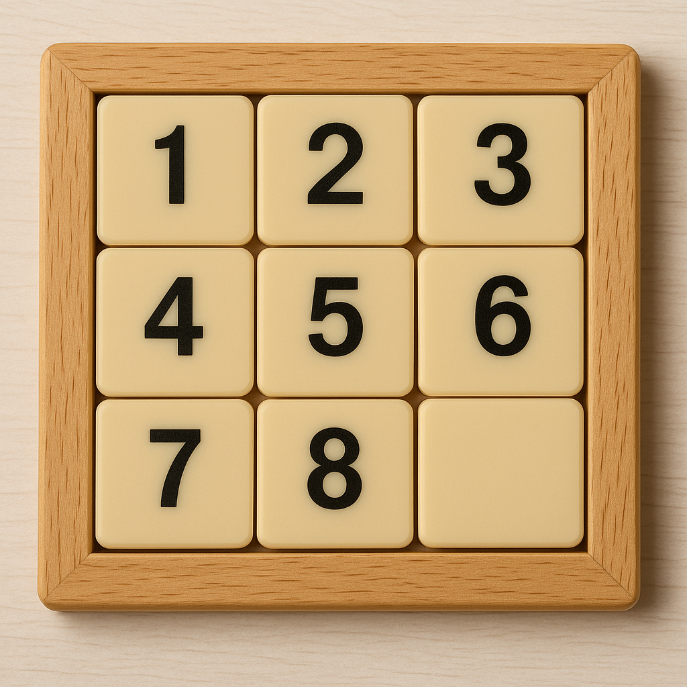
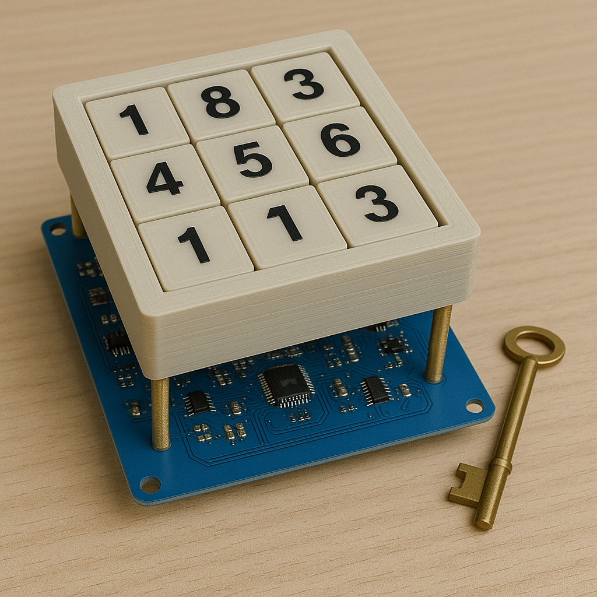
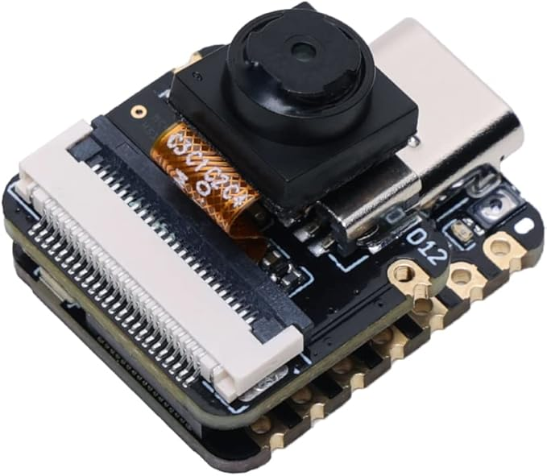
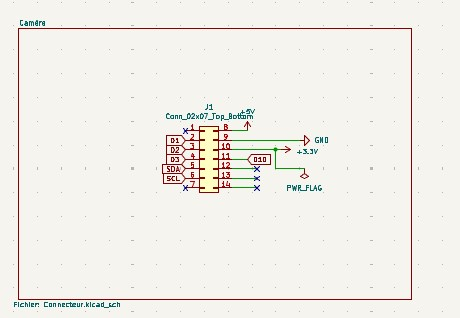
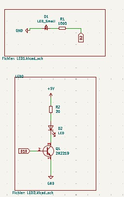
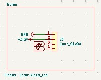
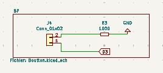
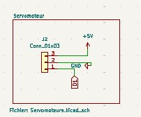
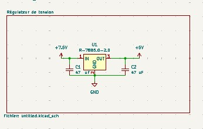

# Projet d'électronique 1A : Jeu du taquin
#### Par:
-Victor FOUREL \
-Agheles MEKDACHE \
-Rania BENSLIMAN \
-Anya ADJOU
#### Réalisé sous la direction de M. Antoine TAUVEL
# Table des matières
###  Introduction 
### 1- Caméra 
### 2- PCB
### 3- Ecran
### 4- Led
### 5- Modèle 3D
### 6- Prototype
### Conclusion
### Bilan
# Introduction 
Dans le cadre du projet d’électronique, nous devions créer un escape game composé de trois chambres. Pour notre chambre, nous avons décidé de réaliser un jeu de taquin. Une fois le puzzle résolu, une clef est délivrée. Cette clef est indispensable pour gagner l’escape game.

  

Le principe du jeu est simple : il s’agit d’un puzzle composé de 8 pièces numérotées de 1 à 8, placées dans une grille de 3x3 avec une case vide. Le joueur doit faire glisser les pièces en utilisant la case vide pour les remettre dans le bon ordre. Le jeu commence avec les pièces dans le désordre, et le joueur doit les réorganiser correctement pour réussir.
## Structure technique

Notre dispositif est composé de plusieurs couches :

- **En dessous** de la structure de jeu se trouve un **capteur**, chargé de suivre les mouvements des pièces et de détecter l’état du puzzle.
- **Le capteur** se trouve sur  un **PCB (circuit imprimé)** qui assure la liaison entre les différents composants électroniques.
- Enfin, la **structure du jeu de taquin en 3D** est positionnée au-dessus de l’ensemble.

Une fois la bonne combinaison atteinte, un mécanisme intégré permet la **libération automatique de la clé**, constituant ainsi la récompense et la progression vers la salle suivante.

  

# 1-Caméra 
Pour assurer un suivi en temps réel de la progression du joueur, nous avons utilisé la caméra ESP32-S3 Sense. Ce module caméra joue le rôle de capteur intelligent : il analyse l’état du puzzle à chaque instant et détecte automatiquement lorsque le joueur a correctement résolu le jeu. Une fois le bon agencement reconnu, la caméra déclenche la libération de la clé.

  

Ce choix technologique nous a permis d’ajouter une dimension interactive et autonome à notre chambre d’escape game, tout en intégrant des compétences en traitement d’image, microcontrôleurs et automatisation.

# 2- PCB
Notre carte PCB se décompose d'abord d'un module ESP32-S3 Sense  intégré  via un connecteur 2x7 broches (J1), permettant son raccordement direct à l’alimentation et aux lignes de communication. Il est alimenté en +3.3V via une broche dédiée, tandis que le reste du système fonctionne en 5V. La caméra communique avec d'autres périphériques (comme l’écran OLED) à travers le bus I2C (SDA/SCL), et plusieurs broches GPIO (D1 à D4) sont disponibles pour des entrées/sorties numériques.

  

Ces GPIO peuvent être utilisés pour contrôler la LED via un transistor, ou piloter le servomoteur chargé de la libération de la clé. Le module réalise localement l’analyse d’image (suivi des positions du puzzle) et déclenche les actions nécessaires via le PCB en fonction de l’état du jeu. Il agit ainsi comme unité centrale de traitement et de commande du système.
 
Après, deux circuits LED sont présents sur le PCB. Le premier est une LED simple avec résistance de limitation, utilisée comme témoin d’alimentation ou d’état général. Le second est une LED contrôlée par un transistor 2N2222, ce qui permet d’allumer une LED plus puissante ou de l’intégrer dans une logique de commande via microcontrôleur. Cette LED peut servir à signaler la résolution du puzzle ou indiquer un changement d’état.

  

Ainsi, on a branché un écran OLED, connecté via le bus I2C, sert d’interface visuelle pour le joueur. Il permet d’afficher des messages utiles : état du jeu, instructions, chronomètre, ou félicitations en cas de réussite. Sa faible consommation et sa simplicité d’utilisation en I2C en font un excellent choix pour les projets embarqués.

  

Après, un bouton-poussoir est également intégré au PCB. Il est utilisé pour démarrer une nouvelle partie, réinitialiser le système et envoyer une commande manuelle à la caméra. Une résistance de pull-down est utilisée pour s’assurer que l’entrée est bien à l’état bas lorsque le bouton n’est pas pressé, évitant ainsi les déclenchements erronés.

  

Le servomoteur est la partie du circuit qui permet d’agir physiquement sur le jeu. Il reçoit un signal électrique envoyé par la caméra ou le microcontrôleur quand le puzzle est résolu. Dès qu’il reçoit ce signal, le servomoteur tourne pour ouvrir une trappe ou libérer une clé. Ce système transforme le succès dans le jeu en une action réelle, ce qui rend l’expérience plus interactive et concrète pour le joueur.

  

Finalement, le système est alimenté par une source de tension de +7.5V, connectée via un bornier dédié. Cette tension est ensuite régulée par un régulateur linéaire 7805, qui abaisse la tension à +5V, nécessaire au bon fonctionnement des composants électroniques. Deux condensateurs de 47 µF (placés en entrée et en sortie du régulateur) assurent la stabilité de la tension en filtrant les éventuelles perturbations électriques. Cette alimentation stabilisée est cruciale pour éviter des comportements imprévisibles, notamment pour le module caméra, le servomoteur et l’écran OLED.

  

# 5- Modèle 3D

### Taquin 3D
Nous réalisé un modèle 3D d’un taquin aux dimensions finales de 6 cm sur 6 cm. Chaque pièce du taquin a été conçue avec des rainures et creux de chaques cotés de chaque pièces, permettant un bon encastrement et un coulissement fluide des pièces entre elles. 
"photo modèoe 3D"
Initialement, une autre taille avait été envisagée, mais nous avons dû adapter les dimensions du modèle en fonction des contraintes imposées par la caméra utilisée, notamment pour garantir une bonne visibilité et un bon suivi des pièces pendant l’utilisation. 
"photo finale"

### Système d'éjéction 3D
Le système d’éjection de clés repose sur un mécanisme à ressorts intégré dans un récipient allongé. Au fond de ce récipient, des clous équitablement répartis servent de support et de guide pour les ressorts, un ressort est inséré dans chaque clou. Une plaque supérieure vient ensuite comprimer ces ressorts, maintenue par un loquet de blocage. Une fois la clé placée au-dessus, ce loquet (relié à un servomoteur) empêche l’éjection tant que le jeu n’est pas terminé. Lorsque l’utilisateur réussit, le servomoteur se déclenche, libère le loquet, et les ressorts se détendent, projetant la clé vers l’extérieur. 

Toutefois, nous n’avons pas réussi à concevoir une solution plus pratique à gérer pour le réalisateur du jeu : en effet, l’éjection entraîne en même temps les ressorts et l’ensemble du mécanisme, rendant le système à usage unique. Il faut donc le reconstituer manuellement entre chaque joueur, ce qui s’avère peu pratique. Pour une prochaine version, il sera essentiel de penser non seulement à la simplicité d’utilisation pour le joueur, mais aussi à la facilité de réinitialisation et de gestion pour la personne du jeu.

# 6- Prototype
Pour le prototype 3D présenté, nous avons fait le choix, par soucis de clarté et par manque de temps, de réaliser une démonstration hors du cube. Le montage a ainsi été fait de manière simplifiée : nous avons assemblé des planches en bois perpendiculaires entre elles, avec deux longueurs différentes — une plus courte et une plus longue. Sur la planche la plus longue, nous avons installé un système de glissoir permettant d’ajuster manuellement la distance de la caméra afin d’obtenir un cadrage optimal du taquin. 

Cependant, plusieurs problèmes techniques ont émergé, notamment au niveau de l’éclairage : la LED utilisée produisait une lumière brute et non diffuse, provoquant des reflets gênants sur le quadrillage utilisé pour la calibration de la caméra. Ce quadrillage, de dimensions 6 cm par 6 cm et correspondant à la taille réelle du taquin, avait été imprimé sur des feuilles avec différentes couleurs destinées à être détectées par la caméra. Toutefois, ces couleurs étaient trop proches en termes de carnation, ce qui causait des imprécisions dans la détection par l’algorithme de traitement d’image. Une solution plus fiable aurait été d’utiliser, pour chaque case du quadrillage représentant le taquin, un pourcentage unique de blanc et de noir. Grâce à ces contrastes bien marqués, l’algorithme aurait pu identifier chaque case de manière plus précise et constante.

